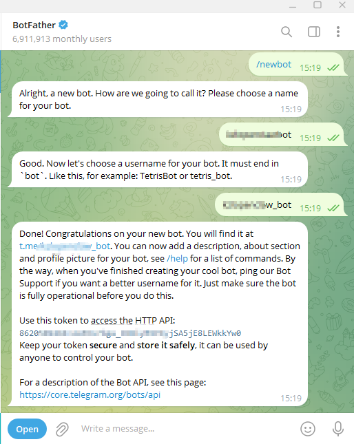
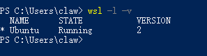
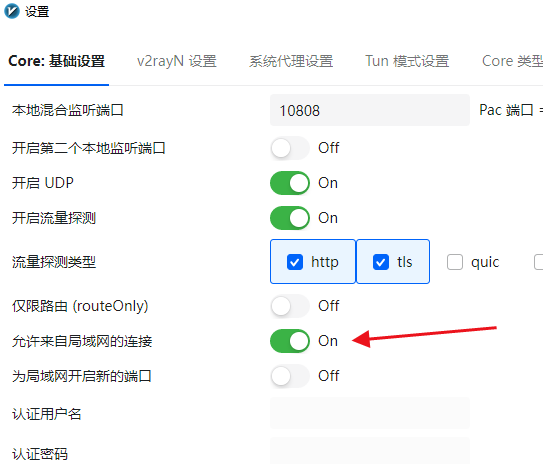
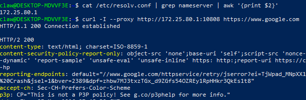
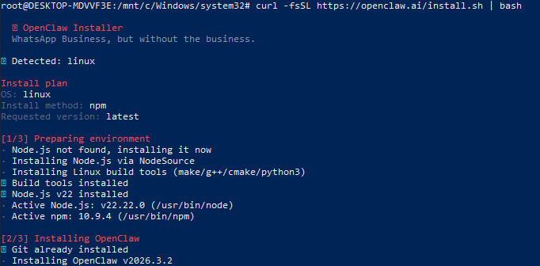
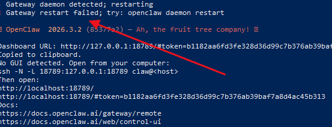
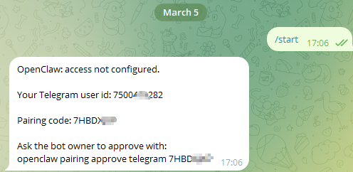

openclaw官方文档：https://docs.openclaw.ai/

### 先准备好大模型的api key
访问openai平台：https://platform.openai.com/api-keys
<br>
生成api key，注意生成好就好复制保存好，否则之后不可见
<br><br>

### 创建新的telegram机器人
机器人可以重复使用，不用每次安装openclaw都申请<br>
搜索`@botfather`，进入对话<br>
输入`/newbot`，根据提示输入名称，保存token<br>

<br><br>
### 官方建议使用 WSL2，使用以下命令 `wsl -l -v` 查看版本，如图：<br>

<br><br>

### 设置代理，让WSL可以使用windows的代理工具V2RAY
#### 设置-参数设置-允许来自局域网的连接<br>


#### 如果不知道哪个端口可用，就先测试一下，V2RAY一般是10808<br>
输入以下命令获取宿主机IP
```
cat /etc/resolv.conf | grep nameserver | awk '{print $2}'
```
使用curl命令测试代理是否可用(ip和端口要替换掉)
```
curl -I --proxy http://172.25.80.1:10808 https://www.google.com
```


#### 设置linux系统代理
编辑.bashrc
```
nano ~/.bashrc
```
光标移动到末尾，添加以下内容(端口换成刚才测试的可用端口)：
```
# 自动获取 Windows 宿主机 IP 并设置代理
export hostip=$(cat /etc/resolv.conf | grep nameserver | awk '{print $2}')
export http_proxy="http://${hostip}:10808"
export https_proxy="http://${hostip}:10808"

# 可选：显示当前代理状态，方便确认
echo "WSL Proxy is active on ${hostip}:10808"
```
Ctrl+o保存，Ctrl+x退出，并且运行下面命令使之生效：
```
source ~/.bashrc
```
最后用curl测试看看
```
curl -I https://www.google.com
```
最后设置V2RAY开机启动，按下键盘上的 Win + R 键，输入 `shell:startup` 并回车，将V2RAY快捷方式放入<br><br><br><br>
### 安装Homebrew
很多skill依赖这个，但是在安装过程中似乎会出现Homebrew安装失败，所以我们是先安装<br>
用管理员模式打开powershell，执行命令：
```
/bin/bash -c "$(curl -fsSL https://raw.githubusercontent.com/Homebrew/install/HEAD/install.sh)"
```

### 用管理员模式打开powershell，进入wsl，执行安装命令：
```
curl -fsSL https://openclaw.ai/install.sh | bash
```
没有安装node.js的话，会自动安装<br>
需要等待一会<br>


#### 按照提示配置，如果出现网关启动失败如下图，那么应该是新版本的运行模式没有设置，导致直接在合理退出。那么则需要运行以下命令指定本地运行模式

```
openclaw config set gateway.mode local
```
执行完命令后重启：
```
openclaw daemon restart
```
重启后执行检查命令:
```
openclaw gateway status
```
确认没问题后，运行以下命令进入配置(如果网关没有启动失败，就不需要这么做，跟随提示一路配置即可)：
```
openclaw onboard --install-daemon
```
### 配置大模型api key和telegram token
根据提示粘贴输入即可


### 配对telegram
进入机器人后(可以点击创建时候的链接进入)，输入/start，机器人回复一串消息，复制最底下的命令执行配对执行，即可通过telegram链接openclaw，如图<br>



---


配置exec工具：https://github.com/kzlgithub/openclaw-exec-install
